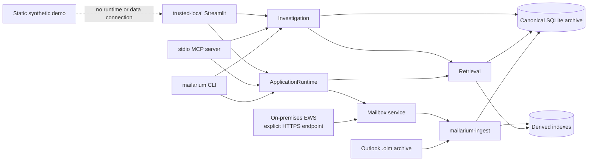
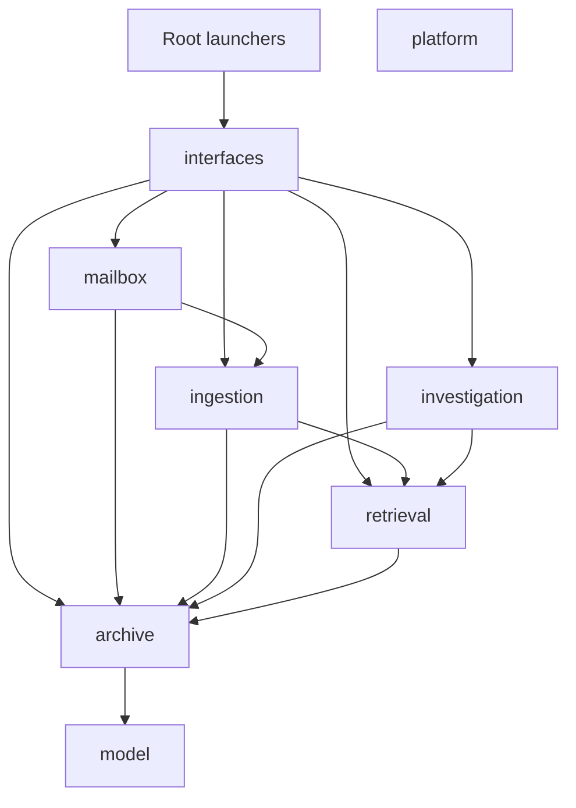
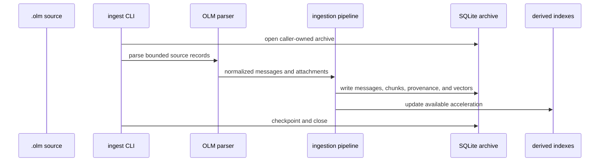

# Architecture

Mailarium is one Python distribution organized as a modular monolith. It
constructs and investigates one local mailbox archive at a time. SQLite owns
canonical application state; USearch, BM25, sparse, and other retrieval indexes
are rebuildable acceleration. Optional EWS support projects selected remote
items into the same archive rather than maintaining a second source of truth.

## System context

The CLI, MCP server, and Streamlit application are independently started
interfaces over the same feature packages. They are not separately published
or deployed services. The files in `demo/` are a dependency-free interface
demonstration and never connect to Mailarium, a mailbox, or a runtime archive.

## Components

| Component | Responsibility |
| --- | --- |
| `mailarium/platform/` | Dependency leaf. `settings.py` holds all Mailarium-owned configuration, runtime profiles, and environment parsing helpers; `repo_paths.py` resolves runtime, output, and local-read roots; `validation.py` and `sanitization.py` hold input checks and output sanitization. |
| `mailarium/model/` | Presentation-neutral messages, attachments, chunks, body normalization, thread inference, and other value objects. |
| `mailarium/archive/` | The only SQLite owner. `ArchiveDatabase` (`database.py`) owns one `ArchiveSession` (`session.py`: connection plus one re-entrant operation lock) and exposes focused repositories under `repositories/` (messages, queries, attachments, evidence, custody, ingest ledger, entities, events, analytics, sparse, vector maintenance, diagnostics, mailbox-source visibility, and `mailbox` for accounts, sources, and proposals). `locking.py` serializes every public repository operation; `schema/` holds tables, migrations, and mailbox tables; `vectors.py` holds canonical vector rows with a rebuildable USearch accelerator; `visibility.py` holds default-retrieval visibility rules. |
| `mailarium/retrieval/` | `SearchEngine` (`retriever.py`) composed from collaborators: query encoding, dense, image, and semantic search, sparse/BM25 retrieval and hybrid fusion (`hybrid.py`), reranking, semantic filters, query expansion, filtered search, visibility, archive summary, diagnostics, and threads. Embedders, index modules, and training helpers live alongside. |
| `mailarium/ingestion/` | OLM parsing (`olm/`), attachment extraction and reprocessing (`attachments/`), entity, event, language, and sentiment enrichment (`enrichment/`), chunking, the ingest/embed pipeline, bounded maintenance, re-embedding, and reset jobs, and EWS record projection (`mailbox_ingest.py`). `api.py` and `context.py` expose the production facades and `ProductionIngestDependencies`; package exports are lazy. |
| `mailarium/investigation/` | Answer-context assembly (`answer_context/`, split by responsibility: lanes, ranking, candidates, provenance, packing, rendering, workflow, and related modules), evidence and HTML exports, reports and dossiers (templates under `templates/`), network, temporal, thread, topic, deduplication, and writing analysis. |
| `mailarium/mailbox/` | `MailboxService` (`service.py`) composes account configuration (`accounts.py`), selected-folder sync (`sync.py`), immutable proposals (`proposals.py`, `ProposalPolicy`), and controlled execution (`execution.py`, `ProposalExecutor`); `policy.py` holds process gates and limits; `ews/` is the bounded HTTPS SOAP transport. |
| `mailarium/interfaces/` | `runtime.py` (`ApplicationRuntime`, long-lived composition); `presentation.py` (result serialization shared by CLI and MCP); `cli/` (entry points, parser, dependencies, and command families under `cli/commands/`); `mcp/` (server, runtime state, instance lock, input models under `mcp/models/`, tools under `mcp/tools/`); `web/` (Streamlit app and pages). |
| Root modules | `cli.py`, `ingest.py`, `mcp_server.py`, `__main__.py`, and `web_app.py` are launchers for the documented invocations and import only `mailarium.interfaces`. |
| `scripts/` | Architecture policy, verification profiles, coverage floors, smokes, operations helpers, and release tooling, including the publication privacy scanner under `scripts/release/privacy/` (not part of the wheel). |

## Dependency direction

`PACKAGE_DEPENDENCIES` and `ROOT_MODULE_DEPENDENCIES` in
`scripts/check_architecture.py` are the executable, complete allow-list. Any
new package or cross-package import must extend it deliberately. The same
script rejects import cycles between packages and between modules, including
inside one package.

Every package except `archive`, `model`, and `platform` may also import
`model` and `platform` directly; `archive` imports only `model`. Important
negative rules:

- `platform` and `model` import nothing else from `mailarium`.
- `archive` does not import retrieval, ingestion, investigation, mailbox, or
  platform.
- `retrieval` does not import ingestion, investigation, or mailbox.
- `ingestion` does not import investigation.
- `mailbox` does not import retrieval.
- investigation and mailbox do not import one another.
- no feature package imports `interfaces` or a root module; root modules import
  only `interfaces`.
- SQL stays inside `archive`.

Run `uv run python scripts/check_architecture.py` whenever imports, package
ownership, or a root module changes.

## Runtime and data flows

### Long-lived interfaces

`ApplicationRuntime` lazily owns one `ArchiveDatabase`, one
`SearchEngine`, and one `MailboxService` for a validated runtime path pair.
The search engine and mailbox service receive the runtime-owned archive; the
mailbox service persists through the archive's `mailbox` repository on the same
connection and operation lock. Neither opens fallback connections. Shutdown
closes mailbox and derived search resources before closing SQLite.

`mailarium/interfaces/web/app.py` (launched through `mailarium/web_app.py`)
maintains one Streamlit `st.cache_resource` runtime
per validated path pair. Search receives its `SearchEngine`; overview, people,
connections, and evidence receive its archive; mailbox receives its mailbox
service. Page modules never create parallel resources. Cache invalidation must
close existing runtimes before clearing the Streamlit cache.

The MCP server constructs the same runtime and holds an exclusive,
stale-process-aware lock for its configured archive. The CLI constructs a
runtime only for the selected command.

### OLM ingestion

Ingestion and maintenance are bounded jobs. They open one caller-owned archive
through `mailarium.archive.open_archive_database`, inject it into embedding
and vector storage, and close it at job completion. Incremental ingest skips
already committed source records; re-embedding rebuilds derived vector state
from stored corrected text.

Vector storage is `SQLiteVectorCollection` (`mailarium/archive/vectors.py`):
SQLite vector rows are canonical and the USearch file is a rebuildable
accelerator, both governed by one atomic checkpoint protocol. The embedding
consumer defers accelerator checkpoints until its bounded job
finishes. Vector rows and retry state still commit to SQLite during the job;
the derived index is rebuilt once per changed embedding space at scope exit.
Nested checkpoint scopes share that boundary. Queries with pending operations
use canonical vectors when an accelerator cannot yet be refreshed.

### Retrieval and investigation

Retrieval reads canonical records, obtains candidates from the indexes
available under the current runtime profile, combines their scores, applies
filters, and returns ranked chunks. Investigation consumes stored archive
records and retrieval results to produce evidence and derived analyses.
Answer-context assembly exposes ambiguity and insufficient-evidence states
instead of converting a ranking into proof.

Vector storage caches metadata snapshots against the connection's change count
and SQLite's external-commit version. Warm queries reuse verified index files
while their identity, size, timestamps, and expected checksum remain unchanged;
explicit verification still hashes the complete file. Answer-context assembly
batches archive lookups across candidates and reuses provenance within one
request.

### EWS synchronization and actions

EWS synchronization requires both process and account read gates. It fetches
bounded deltas only from selected folders, maps them to normalized mailbox
records, and projects them through the ingestion boundary into the canonical
archive. Attachment content has a separate process gate and per-sync flag.

Synchronization and proposal operations reuse one transport session within
their operation scope and close it afterward. Projection batches contain at
most 100 distinct source identities. Canonical rows and durable pending markers
commit together before vector work; source hashes are finalized together only
after indexing and its checkpoint succeed. A repeated source identity starts a
new batch, preserving event order. Failed projection leaves retry markers and
does not advance the folder cursor. Obsolete vectors are selected by message
UID rather than scanning all indexed IDs.

Writes require process and account write gates plus an approved immutable
proposal. Approval and rejection are local interactive CLI operations.
Execution claims the proposal, validates the expected remote item state and
change key, calls the EWS gateway, and records or reconciles the outcome. It
does not silently rebase a stale proposal.

## State ownership and recovery

- The original `.olm` is the external recovery source for archive imports.
- SQLite owns messages, metadata, source mappings, vectors, evidence, custody,
  mailbox configuration, synchronization state, and proposals.
- Retrieval directories and indexes are derived. They may be reset and rebuilt
  without redefining archive truth.
- Credentials remain in externally named environment variables. SQLite stores
  credential reference names, not values.
- Exports are derived disclosure artifacts. They must remain inside allowed
  output roots, never overwrite an existing path, and require review before
  sharing.

Back up both the original source and SQLite before destructive maintenance.
The repository does not provide automated backup, retention, encryption at
rest, or disaster-recovery orchestration.

## Configuration and trust boundaries

All Mailarium-owned configuration is defined in
`mailarium/platform/settings.py`. The CLI, ingest, and MCP `main()` functions
load `.env` when they start, without replacing variables already present in
the process; importing those modules does not load it. Streamlit does not load
`.env`; it uses its process environment and optional validated sidebar path
overrides. Explicit environment values override runtime and MCP profile
defaults, which in turn override dataclass defaults. Runtime and export paths
are resolved by `mailarium/platform/repo_paths.py` and checked against
purpose-specific roots.

OLM, XML, MIME, and attachment content are untrusted input. EWS accepts only an
explicit HTTPS endpoint without embedded credentials. SOAP bodies, credential
values, and synchronization watermarks must not appear in responses or
diagnostics. Streamlit and MCP provide no public-network authentication or
authorization; deployment controls are outside the application.

Model and entity-extraction weights can contact their upstream model sources
unless local-only and no-download settings are selected. Mailarium has no
hosted inference integration and performs no online training on mailbox
content or queries.

## Where new code belongs

- Configuration values, environment parsing, and path roots: `platform/`.
- Value objects shared by several packages, and pure message-content semantics
  such as header and body parsing, normalization, and thread inference:
  `model/`.
- Any SQL, schema change, or migration: a repository or `schema/` in
  `archive/`, exposed through `ArchiveDatabase`.
- Index, embedding, or ranking behavior: a `retrieval/` collaborator composed
  by `SearchEngine`.
- Parsing, extraction, enrichment, or archive-construction jobs: `ingestion/`.
- Analysis, evidence, export, report, or answer-context behavior:
  `investigation/`.
- EWS account, sync, proposal, or execution behavior: `mailbox/`; SOAP
  transport: `mailbox/ews/`.
- Argument parsing, MCP tool schemas, page rendering, and output formatting:
  the matching adapter in `interfaces/`. Keep root modules as launchers.

## Build, verification, and deployment boundaries

Mailarium builds one wheel and one source archive from `pyproject.toml`. The
wheel contains `mailarium*` packages and the investigation HTML templates; it
does not contain `scripts/`.

`scripts/verify.py` owns the verification profiles:

- `fast`: lockfile check, Ruff lint and format check, architecture policy
  (package allow-list and package/module import-cycle checks).
- `pr`: the static `fast` checks, mypy, offline and native-storage ingest
  smokes, Bandit, dependency audit, and the publication privacy scan.
- `package`: Streamlit AppTest smoke, build, locked requirements export,
  artifact inspection, and installed-wheel smoke.
- `release`: `pr` followed by `package`. It validates and installs local
  artifacts but does not publish them.

The Streamlit application is a local process. The static `demo/` can be
served directly or published by its Pages workflow, but that deployment is
only a synthetic demonstration. The repository contains no supported hosted
Mailarium deployment, migration service, public API gateway, authentication
layer, or operational database service.

No local profile proves live EWS interoperability, real model downloads, a
manual browser session, remote CI, a Pages deployment, or package publication.
